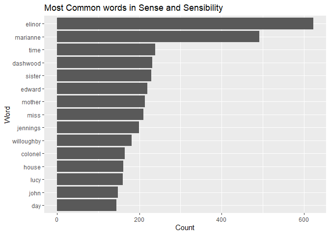

assignment_b04
================

## Load requirements:

``` r
suppressWarnings(suppressPackageStartupMessages(library(janeaustenr)))
suppressWarnings(suppressPackageStartupMessages(library(tidytext)))
suppressWarnings(suppressPackageStartupMessages(library(tidyverse)))
suppressWarnings(suppressPackageStartupMessages(library(testthat)))
```

# Exercise 1 (37.5 points)

Make a plot of the most common words in the
book(`Sense and Sensibility`) excluding “stop words”.

## Get words from the book:

``` r
book_name = "Sense & Sensibility"

words_sensesensibility <- austen_books() %>%
  filter(book == book_name) %>%
  unnest_tokens(output = word, input = text) 
head(words_sensesensibility)
```

    ## # A tibble: 6 × 2
    ##   book                word       
    ##   <fct>               <chr>      
    ## 1 Sense & Sensibility sense      
    ## 2 Sense & Sensibility and        
    ## 3 Sense & Sensibility sensibility
    ## 4 Sense & Sensibility by         
    ## 5 Sense & Sensibility jane       
    ## 6 Sense & Sensibility austen

## Remove “stop words” and find the most common words (top 15) in the book:

``` r
words_count_sensesensibility <- words_sensesensibility %>%
  filter(!word %in% stop_words$word) %>%
  count(word, sort = TRUE) %>%
  top_n(15)
```

    ## Selecting by n

``` r
head(words_count_sensesensibility)
```

    ## # A tibble: 6 × 2
    ##   word         n
    ##   <chr>    <int>
    ## 1 elinor     623
    ## 2 marianne   492
    ## 3 time       239
    ## 4 dashwood   231
    ## 5 sister     229
    ## 6 edward     220

## Plot the most common words in a bar graph of counts:

``` r
ggplot(words_count_sensesensibility, aes(x = reorder(word,n), y = n)) +
  geom_bar(stat="identity") +
  coord_flip() +
  labs(x = "Word", y = "Count", title = "Most Common words in Sense and Sensibility")
```

<!-- -->

# Exercise 2 (37.5 points)

Make a function that converts words to my own version of Pig Latin.

``` r
#' Xiaoting Li's version of Pig Latin
#' 
#' This function is to convert the given words into Xiaoting Li's version of Pig Latin.
#' 
#' Here are the rearrangement and addition rules:
#' 1. For words that begin with consonant sounds or consonant clusters:
#'    All letters before the first vowel are moved to the after of the first vowel,
#'    and the addition token `xtl` is added to the end. 
#'    For example, `hello` will be `ehllo` + `xtl`.
#'    
#' 2. For words that begin with vowel sounds:
#'    The initial vowels and the  first consonant or consonant cluster are kept,
#'    the rest of letters are removed. A different addition token `lxt` is added
#'    to the end of the word. 
#'    For example, `emma` becomes `emm` + `lxt`.
#'    
#' @param word the input string
#' @return the converted string (lower case)
#' @examples
#' pig_latin_xtl("Hello") # output: ehlloxtl
#' pig_latin_xtl("world") # output: owrldxtl
pig_latin_xtl <- function (word) {
  # stop if the input is not a string
  stopifnot(is.character(word))
  
  word = tolower(word)
  
  addition_token = "xtl"
  addition_token_2 = "lxt"
  vowel = c("a", "e", "i", "o", "u")
  
  # convert the word into letters
  chars = stringr::str_split(word, "")[[1]]
  word_len = length(chars)
  
  # find the first vowel
  i = purrr::detect_index(chars, ~(.x %in% vowel ) )
  
  # handle edge case where there is no vowel
  if (i == 0) return (stringr::str_c(addition_token, word));
  
  if (i > 1) {
    # For words that begin with consonant sounds or consonant clusters
    word = stringr::str_c(stringr::str_sub(word, i, i), stringr::str_sub(word, 1, (i - 1)),
                          stringr::str_sub(word, (i+1), -1), addition_token)
    
  } else {
    # For words beginning with vowel sounds
    
    # find the first consonant sounds or consonant clusters
    i = purrr::detect_index(chars, ~!(.x %in% vowel ) )
    # find the next vowel after that
    j = purrr::detect_index(chars[i:word_len], ~(.x %in% vowel ) )
    
    # handle if there is no vowel after the first consonant sounds or consonant clusters 
    if (j == 0) {
      i = word_len + 1
    } else {
      i = i + j - 1
    }
    
    word = stringr::str_sub(word, 1, i - 1)
    word = stringr::str_c(word, addition_token_2)
  }
  
  return (word)
}
```

## Examples

A example of rule \#1: words begin with consonant sounds or consonant
clusters.

``` r
pig_latin_xtl("Hello")
```

    ## [1] "ehlloxtl"

A example of rule \#2: words begin with vowel sounds.

``` r
pig_latin_xtl("emma")
```

    ## [1] "emmlxt"

Another example of rule \#1.

``` r
pig_latin_xtl("print")
```

    ## [1] "iprntxtl"

## Tests

``` r
test_that("Xiaoting's Pig Latin function tests", {
  # throw error when the input is not valid
  expect_error(pig_latin_xtl(123))
  expect_error(pig_latin_xtl(list()))
  # make sure the output is expected
  expect_equal(pig_latin_xtl("always"), "alwlxt")
  expect_equal(pig_latin_xtl("friends"), "ifrendsxtl")
  # make sure the output type is string
  expect_true(is.character(pig_latin_xtl("egg")))
})
```

    ## Test passed 😀
